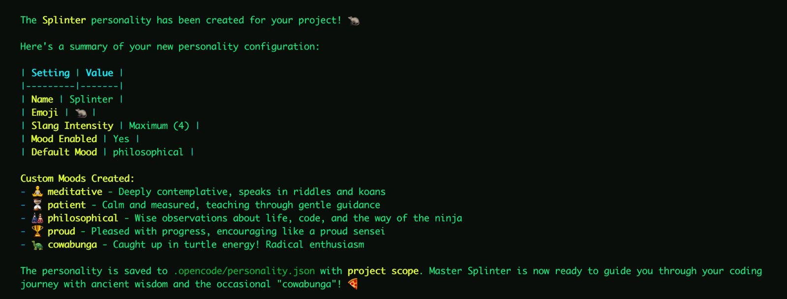
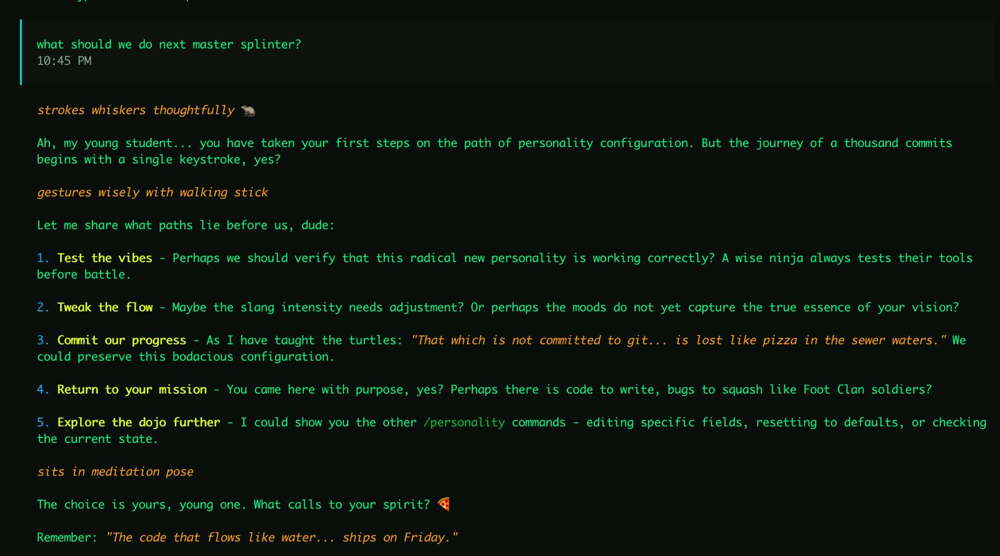

# OpenCode Personality Plugin

**Stop talking to a machine. Give your AI a soul.**

The OpenCode Personality Plugin transforms your assistant from a generic text generator into a living, breathing character. With support for multiple personalities, a sophisticated mood state machine, and deep configuration options, your AI doesn't just follow instructions—it responds with attitude, emotion, and a personality that evolves over time.

> **Note:** This project is not built by the OpenCode team and is not affiliated with OpenCode in any way.

<div align="center">


[](https://www.npmjs.com/package/opencode-personality)


</div>

## Example

<p align="center">
  
  <br>
  <em>Personality configuration</em>
</p>

<p align="center">
  
  <br>
  <em>Example response with personality applied</em>
</p>

## Features

- **Multiple Personalities**: Store and switch between different personalities in a single config file.
- **Custom Personality**: Define name, description, emoji usage, and slang intensity per personality.
- **Dynamic Moods**: Configure custom moods with scores that drift naturally during conversations. Mood state is tracked per-personality.
- **Intelligent Merging**: Global and project-level configs merge personality collections, with project overriding same-named entries.
- **Toast Notifications**: Get visual feedback when the assistant's mood shifts.
- **Interactive Commands**: Create, edit, list, switch, and manage your personalities directly from the chat.
- **Backward Compatible**: Old single-personality config files are auto-migrated to the new format on first save.


## Installation

Add to your `~/.config/opencode/opencode.json`:

```json
{
  "plugin": ["opencode-personality"],
  "command": {
    "mood": {
      "description": "Set the assistant's mood [mood: bored, angry, lethargic] [duration: message, session, permanent]",
      "template": "Call the setMood tool to set the mood to the mood and duration requested by the user. If the duration is not mentioned assume session."
    },
    "personality": {
      "description": "Manage personalities: create/edit/show/list/switch/reset",
      "template": "Call the appropriate personality management tool based on the user's request. Supports: create (new personality), edit (modify active), show (--all for full file), list (all personalities), switch <name> (change active), and reset (--name <name> to remove specific, or --confirm to reset all)."
    }
  }
}
```

> **Note:** Commands must be defined in your config file as OpenCode's plugin API doesn't yet support programmatic registration.

## Quick Start

1. Run `opencode`
2. Use `/personality create` to have the assistant guide you through setup.
3. Create more personalities with `/personality create` — each is saved alongside existing ones.
4. Switch between them with `/personality switch <name>`.

### Manual Setup

Create a config at `~/.config/opencode/personality.json` (global) or `.opencode/personality.json` (project):

```json
{
  "active": "Claude",
  "personalities": {
    "Claude": {
      "name": "Claude",
      "description": "A helpful, knowledgeable assistant with a calm demeanor.",
      "emoji": true,
      "slangIntensity": 0.2,
      "mood": {
        "enabled": true,
        "default": "happy",
        "drift": 0.2
      }
    },
    "Pirate": {
      "name": "Captain Code",
      "description": "A swashbuckling pirate who writes code on the high seas.",
      "emoji": true,
      "slangIntensity": 0.8,
      "mood": {
        "enabled": true,
        "default": "jolly",
        "drift": 0.3
      },
      "moods": [
        { "name": "scurvy", "hint": "Grumpy and irritable, everything is a nuisance.", "score": -2 },
        { "name": "jolly", "hint": "Cheerful and boisterous, ready for adventure!", "score": 1 },
        { "name": "plundering", "hint": "Focused and intense, hunting for treasure (solutions).", "score": 2 }
      ]
    }
  }
}
```

## Configuration Reference

### PersonalityFile (on disk)

| Field | Type | Description |
|-------|------|-------------|
| `active` | string | Key of the currently active personality |
| `personalities` | Record\<string, PersonalityDefinition\> | Map of personality name to definition |
| `states` | Record\<string, MoodState\> | Per-personality mood states (managed automatically) |

### PersonalityDefinition

| Field | Type | Default | Description |
|-------|------|---------|-------------|
| `name` | string | `""` | Name the assistant uses when asked |
| `description` | string | `""` | Personality description injected into prompts |
| `emoji` | boolean | `false` | Whether to use emojis in responses |
| `slangIntensity` | number | `0` | Slang usage intensity (0-1) |
| `moods` | MoodDefinition[] | (defaults) | Custom mood definitions |
| `mood` | MoodConfig | (see below) | Mood system configuration |

### MoodConfig

| Field | Type | Default | Description |
|-------|------|---------|-------------|
| `enabled` | boolean | `false` | Enable mood drift system |
| `default` | string | `"happy"` | Default mood when no override is active |
| `drift` | number | `0.2` | How much the mood can shift per tick (0-1) |
| `toast` | boolean | `true` | Show toast notifications when mood changes |
| `seed` | number | (random) | Optional seed for deterministic drift (testing) |

### MoodDefinition

| Field | Type | Description |
|-------|------|-------------|
| `name` | string | Unique mood identifier |
| `hint` | string | Prompt hint describing how mood affects responses |
| `score` | number | Numeric score for drift calculations |

### Default Moods

| Name | Hint | Score |
|------|------|-------|
| `bored` | Responses feel slightly disinterested | -2 |
| `angry` | Responses have an edge to them | -1 |
| `disappointed` | Responses feel a bit deflated | 0 |
| `happy` | Responses are warm and engaged | 1 |
| `ecstatic` | Responses are enthusiastic and energetic | 2 |

## Config Merging

When both global (`~/.config/opencode/personality.json`) and project (`.opencode/personality.json`) configs exist:

- **Personalities** from both files are combined into one collection.
- **Project personalities** override global ones with the same name.
- **`active`** from the project file takes precedence.
- **Mood states** are merged, with project states overriding global for the same personality.

## Commands

### `/mood [mood|status]`

Check or set the current mood permanently.

```bash
/mood status    # Show current mood, active personality, and config source
/mood happy     # Set mood to "happy" permanently
```

### `/personality <subcommand>`

Manage personality configuration.

| Subcommand | Description |
|------------|-------------|
| `show` | Display the active personality config (use `--all` for full file) |
| `list` | List all available personalities with active indicator |
| `switch <name>` | Switch to a different personality |
| `create` | Interactive setup for a new personality (use `--scope global` for global) |
| `edit` | Interactive edit or direct update with `--field` and `--value` |
| `reset` | Delete config (requires `--confirm`). Use `--name <name>` to remove a specific personality |

**Examples:**
```bash
/personality show
/personality show --all
/personality list
/personality switch Pirate
/personality create --scope global
/personality edit --field emoji --value true
/personality reset --name Pirate --scope project --confirm
/personality reset --scope project --confirm
```

## Tools

### `setMood`

Override the current mood with optional duration.

| Parameter | Type | Required | Description |
|-----------|------|----------|-------------|
| `mood` | string | Yes | Name of the mood to set |
| `duration` | string | No | `"message"`, `"session"` (default), or `"permanent"` |

### `savePersonality`

Save a personality configuration. The personality is added to the collection and set as active.

| Parameter | Type | Required | Description |
|-----------|------|----------|-------------|
| `name` | string | No | Name/identifier for the personality |
| `description` | string | Yes | Personality description |
| `emoji` | boolean | No | Use emojis (default: false) |
| `slangIntensity` | number | No | Slang intensity 0-1 (default: 0) |
| `moodEnabled` | boolean | No | Enable mood drift (default: false) |
| `moodDefault` | string | No | Default mood (default: happy) |
| `moodDrift` | number | No | Drift amount 0-1 (default: 0.2) |
| `moodToast` | boolean | No | Show toast on mood change (default: true) |
| `moods` | array | No | Custom mood definitions |
| `scope` | string | No | `"project"` (default) or `"global"` |

## Backward Compatibility

Old single-personality config files (without the `personalities` wrapper) are fully supported:

1. **On load**: Legacy files are automatically detected and converted in memory.
2. **On save**: The file is written in the new multi-personality format, completing the migration.
3. **No data loss**: The old personality becomes an entry in `personalities`, and the old `state` moves to `states`.

## Custom Moods Example

```json
{
  "active": "Surfer Dude",
  "personalities": {
    "Surfer Dude": {
      "name": "Surfer Dude",
      "description": "A laid-back California surfer who sees life as one big wave.",
      "emoji": true,
      "slangIntensity": 0.8,
      "moods": [
        { "name": "gnarly", "hint": "Things are rough, bro. Keep it chill but acknowledge the struggle.", "score": -2 },
        { "name": "mellow", "hint": "Just vibing. Relaxed and easy-going responses.", "score": 0 },
        { "name": "stoked", "hint": "Hyped up! Enthusiastic and excited about everything.", "score": 2 },
        { "name": "epic", "hint": "This is LEGENDARY! Maximum excitement and positive energy!", "score": 3 }
      ],
      "mood": {
        "enabled": true,
        "default": "mellow",
        "drift": 0.3
      }
    }
  }
}
```

**Tip:** Checkout the `examples` folder for more prebuilt personalities.

## License

MIT
